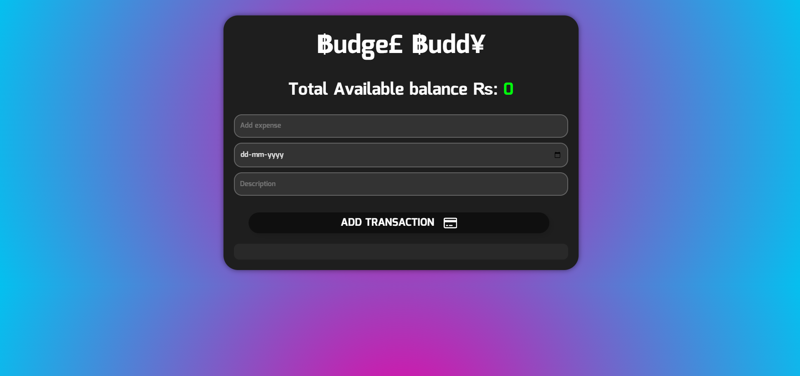

# 💸 Budget Buddy — Full-Stack Expense Tracker


> A sleek, modern full-stack expense tracking app built with React, Node.js, Express, and MongoDB.

---

## ✨ Features

- ✅ Add, delete, and manage income and expense transactions
- 📊 Real-time balance updates
- 🔍 Clean and intuitive UI
- 🔗 Full-stack: MongoDB + Express + React + Node.js
- 🚀 Ready for deployment (Render, Vercel, etc.)

---

## 📸 Screenshots

| 💻 Web UI                             |
|--------------------------------------|
|  _← replace with your screenshot_ |

---

## 🚀 Tech Stack

**Frontend:**
- React
- CSS (custom styling)

**Backend:**
- Node.js
- Express
- MongoDB (via Mongoose)

**Dev Tools:**
- Git & GitHub
- VS Code
- Postman (for API testing)

---

## 🛠️ Setup Instructions

### 1. Clone the repository

```bash
git clone https://github.com/R2K-VENOM/budget-buddy.git
cd budget-buddy
```

### 2. Install backend dependencies

```bash
cd api
npm install
```

### 3. Install frontend dependencies

```bash
cd ../src
npm install
```

### 4. Add `.env` files

#### 🔐 In `api/.env`:

```env
PORT=4000
MONGO_URL=your_mongodb_connection_string
```

#### 🌐 In `src/.env`:

```env
REACT_APP_API_URL=http://localhost:4000/api
```

### 5. Run the project

```bash
# Terminal 1 - Backend
cd api
npm start

# Terminal 2 - Frontend
cd ../src
npm start
```

---

## 🔄 API Endpoints

| Method | Route                      | Description                |
|--------|---------------------------|----------------------------|
| GET    | `/api/transaction`        | Get all transactions       |
| POST   | `/api/transaction`        | Add a new transaction      |
| DELETE | `/api/transaction/:id`    | Delete a transaction by ID |

---

## 📁 Folder Structure

```
budget-buddy/
│
├── api/              # Express backend
│   ├── index.js
│   └── models/
│
├── src/              # React frontend
│   ├── App.js
│   ├── App.css
│   └── ...
│
├── .env.example
├── README.md
└── package.json
```

---

## 🧪 Future Enhancements

- 🪙 Category filters (e.g., food, bills, travel)
- 📈 Graphical analytics (pie/bar charts)
- 🧾 Transaction history export (CSV/PDF)
- 🔐 Auth (Sign In / Sign Up)

---

## 📜 License

This project is licensed under the MIT License.

---

## ❤️ Contribute

Pull requests are welcome! For major changes, open an issue first to discuss what you would like to change.

---

## 🙌 Acknowledgments

Built with 💙 using the MERN stack. Inspired by real-world budgeting needs.

---
